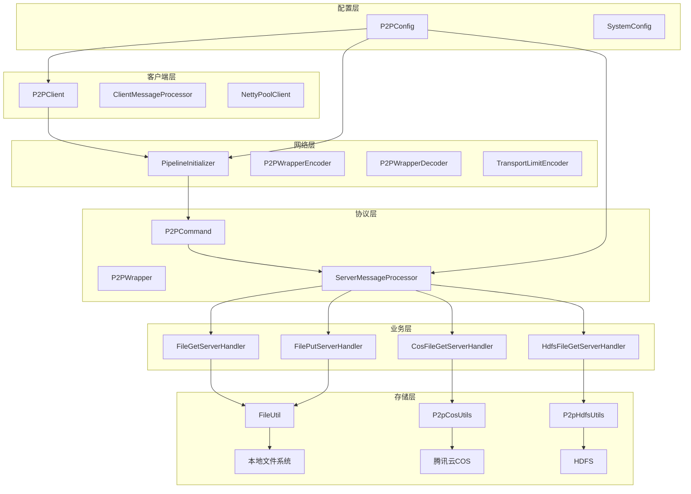
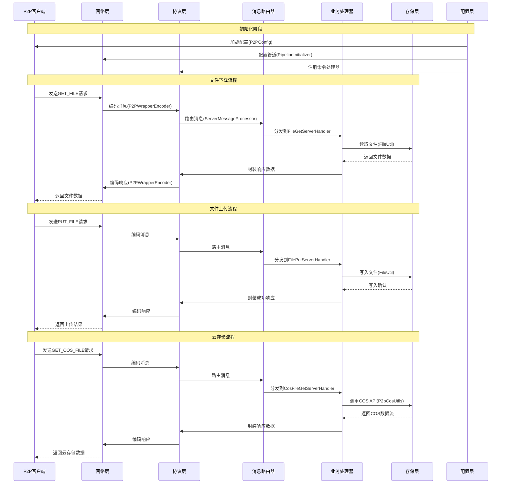

# P2P通信和存储系统 架构设计文档

## 模块交互关系图

### 整体模块交互图



### 详细数据流交互图



## 核心模块交互详情

### 1. 网络层与协议层交互

#### 1.1 编码器交互
```
网络层接收原始数据 → P2PWrapperDecoder解码 → 生成P2PWrapper对象
    ↓
P2PWrapper对象 → 提取P2PCommand → 确定消息类型
    ↓
消息类型 → ServerMessageProcessor路由 → 对应业务处理器
```

#### 1.2 解码器交互
```
业务处理器处理完成 → 生成响应数据 → 封装为P2PWrapper
    ↓
P2PWrapper对象 → P2PWrapperEncoder编码 → 二进制数据
    ↓
二进制数据 → TransportLimitEncoder分片 → 网络发送
```

### 2. 协议层与业务层交互

#### 2.1 消息路由机制
```
ServerMessageProcessor 维护命令映射表:
    GET_FILE → FileGetServerHandler
    PUT_FILE → FilePutServerHandler  
    GET_COS_FILE → CosFileGetServerHandler
    GET_HDFS_FILE → HdfsFileGetServerHandler
    
路由流程:
    1. 接收P2PWrapper消息
    2. 提取command字段
    3. 查找对应的Handler
    4. 调用handler.process()方法
    5. 返回处理结果
```

#### 2.2 处理器注册机制
```java
// 抽象基类自动注册处理器
public abstract class AbstractTcpMessageProcessor {
    protected void registerHandlers() {
        // 注册文件操作处理器
        registerHandler(P2PCommand.GET_FILE, new FileGetServerHandler());
        registerHandler(P2PCommand.PUT_FILE, new FilePutServerHandler());
        // 注册云存储处理器
        registerHandler(P2PCommand.GET_COS_FILE, new CosFileGetServerHandler());
        // 注册HDFS处理器
        registerHandler(P2PCommand.GET_HDFS_FILE, new HdfsFileGetServerHandler());
    }
}
```

### 3. 业务层与存储层交互

#### 3.1 文件操作交互
```
FileGetServerHandler.process():
    1. 解析文件路径和偏移量
    2. 调用FileUtil.readFile()读取文件
    3. 使用FileChannel实现零拷贝
    4. 返回文件数据分片
    
FilePutServerHandler.process():
    1. 解析文件数据和位置
    2. 调用FileUtil.writeFile()写入文件
    3. 验证数据完整性(MD5校验)
    4. 返回写入结果
```

#### 3.2 云存储交互
```
CosFileGetServerHandler.process():
    1. 解析COS对象键和存储桶
    2. 调用P2pCosUtils.getObject()获取对象
    3. 使用COS SDK流式读取
    4. 分片返回数据
    
CosFilePutServerHandler.process():
    1. 解析上传数据和元数据
    2. 调用P2pCosUtils.putObject()上传
    3. 支持分片上传和断点续传
    4. 返回上传结果
```

#### 3.3 HDFS交互
```
HdfsFileGetServerHandler.process():
    1. 解析HDFS文件路径
    2. 调用P2pHdfsUtils.readFile()读取
    3. 支持块级数据读取
    4. 返回文件数据
    
HdfsFilePutServerHandler.process():
    1. 解析HDFS路径和数据
    2. 调用P2pHdfsUtils.writeFile()写入
    3. 支持数据副本配置
    4. 返回写入结果
```

### 4. 配置层与各模块交互

#### 4.1 配置加载机制
```
P2PConfig 单例模式:
    1. 加载application.yml配置文件
    2. 解析服务器配置(端口、线程数等)
    3. 解析存储配置(本地路径、COS配置等)
    4. 提供热重载支持
    
配置使用:
    网络层: 获取SSL配置、端口设置
    协议层: 获取超时时间、缓冲区大小
    业务层: 获取存储路径、分片大小
    存储层: 获取连接参数、认证信息
```

#### 4.2 动态配置更新
```java
// 配置监听器模式
public class P2PConfig {
    private List<ConfigChangeListener> listeners = new ArrayList<>();
    
    public void addChangeListener(ConfigChangeListener listener) {
        listeners.add(listener);
    }
    
    public void reloadConfig() {
        // 重新加载配置
        loadConfig();
        // 通知所有监听器
        for (ConfigChangeListener listener : listeners) {
            listener.onConfigChanged(this);
        }
    }
}
```

## 线程模型交互

### Netty事件循环模型
```
主从Reactor线程模型:
    BossGroup (1个线程): 接受客户端连接
    WorkerGroup (N个线程): 处理I/O读写
    
线程交互:
    客户端连接 → BossGroup接受 → 注册到WorkerGroup
    数据到达 → WorkerGroup处理 → 业务线程池执行
    响应返回 → WorkerGroup写回 → 客户端接收
```

### 业务线程池交互
```
ExecutorServicePool 管理多个线程池:
    IO密集型任务: 大线程池，处理文件读写
    CPU密集型任务: 小线程池，处理计算任务
    定时任务: 调度线程池，处理心跳等
    
线程池使用:
    FileGetServerHandler: 使用IO线程池
    FilePutServerHandler: 使用IO线程池  
    CosFileGetServerHandler: 使用网络线程池
    HeartBeatMessageProcessor: 使用定时线程池
```

## 异常处理交互

### 异常传播机制
```
网络层异常 → 协议层捕获 → 生成错误响应
    ↓
协议层异常 → 业务层捕获 → 记录日志并返回错误
    ↓
业务层异常 → 存储层捕获 → 回滚操作并上报
    ↓
配置层异常 → 系统级处理 → 优雅降级或重启
```

### 错误响应交互
```java
// 统一错误处理
public class ServerMessageProcessor {
    public void processMessage(P2PWrapper wrapper) {
        try {
            P2PCommandHandler handler = getHandler(wrapper.getCommand());
            P2PWrapper response = handler.process(wrapper);
            sendResponse(response);
        } catch (Exception e) {
            // 生成标准错误响应
            P2PWrapper errorResponse = createErrorResponse(
                wrapper.getCommand(), 
                e.getMessage()
            );
            sendResponse(errorResponse);
            log.error("消息处理失败", e);
        }
    }
}
```

## 性能优化交互

### 1. 对象池交互
```
ThreadLocal对象池:
    每个线程维护P2PWrapper对象池
    请求处理时从池中获取对象
    处理完成后归还到池中
    减少GC压力和对象创建开销
    
ByteBuf池化:
    Netty的ByteBufAllocator管理
    直接内存分配减少堆内存压力
    引用计数自动释放内存
```

### 2. 缓存交互
```
文件元数据缓存:
    LRU缓存存储文件大小、修改时间等
    减少文件系统访问次数
    缓存失效策略基于文件修改时间
    
连接池缓存:
    NettyChannelPool缓存TCP连接
    连接复用减少握手开销
    空闲连接超时自动关闭
```

### 3. 零拷贝交互
```
FileChannel传输:
    读取: FileChannel → MappedByteBuffer → Netty ByteBuf
    写入: Netty ByteBuf → FileChannel
    避免数据在JVM堆内存中的拷贝
    
CompositeByteBuf:
    合并多个小ByteBuf为一个大缓冲区
    减少内存碎片和数据拷贝
    提高大文件传输效率
```

## 安全机制交互

### 1. SSL/TLS交互
```
PipelineInitializer配置:
    添加SslHandler到管道首部
    支持证书验证和加密通信
    配置加密算法和协议版本
    
证书管理:
    自签名证书生成(BouncyCastle)
    CA证书加载和验证
    证书链验证和吊销检查
```

### 2. 认证授权交互
```
登录认证流程:
    客户端发送LOGIN命令
    服务器验证用户名密码
    生成会话Token返回
    后续请求携带Token验证
    
权限检查:
    文件访问前检查用户权限
    存储操作前验证操作权限
    审计日志记录所有操作
```

## 监控告警交互

### 1. 指标收集交互
```
系统指标:
    CPU/内存使用率(oshi-core)
    网络连接数和吞吐量
    磁盘IO和空间使用
    
业务指标:
    请求处理时间和成功率
    文件传输速度和大小
    错误类型和频率统计
```

### 2. 日志收集交互
```
结构化日志:
    使用SLF4J+Logback框架
    JSON格式结构化日志
    日志级别动态调整
    
日志聚合:
    本地日志文件轮转
    远程日志收集(可选)
    日志分析和告警
```

## 扩展点交互

### 1. 插件扩展交互
```
处理器插件:
    实现P2PCommandHandler接口
    通过SPI机制自动发现
    动态注册到消息处理器
    
协议扩展:
    自定义消息编码格式
    扩展P2PCommand枚举
    添加新的命令类型
```

### 2. 存储扩展交互
```
存储后端插件:
    实现StorageProvider接口
    配置文件中指定存储类型
    动态加载存储实现
    
多存储支持:
    同时支持本地、COS、HDFS
    根据文件路径路由到不同存储
    存储间数据迁移支持
```

## 部署架构交互

### 1. 单机部署交互
```
进程内通信:
    所有模块在同一个JVM内
    通过方法调用和事件总线通信
    共享内存和线程池资源
    
外部依赖:
    配置文件外部化
    日志文件外部存储
    临时文件外部目录
```

### 2. 集群部署交互
```
服务发现:
    注册到服务注册中心
    健康检查机制
    负载均衡策略
    
数据同步:
    配置文件集中管理
    会话状态共享(可选)
    文件元数据同步(可选)
```

### 3. 容器化部署交互
```
Docker集成:
    多阶段构建优化镜像大小
    环境变量配置注入
    健康检查端点暴露
    
Kubernetes集成:
    Deployment配置副本数
    Service暴露服务端口
    ConfigMap管理配置文件
    PersistentVolume存储数据
```

## 测试架构交互

### 1. 单元测试交互
```
模块隔离测试:
    使用Mockito模拟依赖
    测试单个模块功能
    验证接口契约
    
集成测试:
    测试模块间交互
    验证数据流正确性
    性能基准测试
```

### 2. 端到端测试交互
```
完整流程测试:
    启动真实服务器
    客户端连接和操作
    验证功能完整性
    
压力测试:
    模拟多用户并发
    测试系统极限
    性能瓶颈分析
```

## 维护和演进

### 1. 版本兼容性
```
协议版本兼容:
    支持多版本协议共存
    向后兼容性保证
    平滑升级机制
    
API兼容性:
    公共API保持稳定
    废弃API标记和迁移
    版本发布说明
```

### 2. 监控和维护
```
运行状态监控:
    实时监控关键指标
    自动告警机制
    故障自愈能力
    
维护操作:
    在线配置更新
    优雅重启支持
    数据备份恢复
```

---

*本文档描述了ImageFileServer项目各模块之间的详细交互关系，包括数据流、控制流、异常处理、性能优化等方面，为项目开发和维护提供完整的架构参考。*