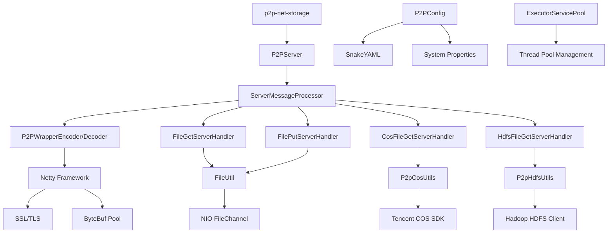

# p2p-net-storage 项目结构文档

## 项目整体结构

```
p2p-net-storage/
├── src/                          # 源代码目录
│   ├── main/                     # 主代码目录
│   │   ├── java/                 # Java源代码
│   │   │   ├── javax/net/p2p/    # P2P协议核心模块
│   │   │   ├── com/giyo/chdfs/   # 腾讯云COS和HDFS工具
│   │   │   ├── com/flydean17/    # 示例和测试代码
│   │   │   ├── com/flydean36/    # SOCKS代理示例
│   │   │   ├── com/flydean41/    # UDT消息示例
│   │   │   └── io/protostuff/    # Protostuff扩展
│   │   └── resources/            # 资源文件
│   └── test/                     # 测试代码
├── target/                       # 构建输出目录
├── lib/                          # 第三方库
├── .codebuddy/                   # CodeBuddy配置
├── README.md                     # 项目说明文档
├── ARCHITECTURE.md               # 架构设计文档
├── DESIGN_PRINCIPLES.md          # 设计原则文档
├── PROJECT_STRUCTURE.md          # 项目结构文档（本文档）
├── pom.xml                       # Maven配置文件
├── nb-configuration.xml          # NetBeans配置
└── nbactions.xml                 # NetBeans动作配置
```

## 核心模块详细结构

### 1. P2P协议核心模块 (`javax/net/p2p/`)

```
javax/net/p2p/
├── api/                          # 协议API定义
│   ├── P2PCommand.java           # 协议命令枚举
│   └── ...                       
├── channel/                      # 网络通道管理
│   ├── PipelineInitializer.java  # 管道初始化器
│   ├── AbstractTcpMessageProcessor.java  # TCP消息处理器基类
│   ├── AbstractUdpMessageProcessor.java  # UDP消息处理器基类
│   ├── AbstractQuicMessageProcessor.java # QUIC消息处理器基类
│   ├── HeartBeatMessageProcessor.java    # 心跳处理器
│   ├── AbstractStreamRequestAdapter.java # 流请求适配器
│   ├── AbstractStreamResponseAdapter.java # 流响应适配器
│   ├── AbstractOrderedStreamHandlerAdapter.java # 有序流处理器
│   ├── AbstractLongTimedRequestAdapter.java # 长时请求适配器
│   ├── ChannelUtils.java         # 通道工具类
│   └── ...
├── client/                       # 客户端模块
│   ├── P2PClient.java            # 主客户端类
│   ├── AbstractP2PClient.java    # 客户端抽象基类
│   ├── ClientMessageProcessor.java # 客户端消息处理器
│   ├── ClientSendMesageExecutor.java # 消息发送执行器
│   ├── ClientSendTcpMesageExecutor.java # TCP消息发送器
│   ├── ClientSendUdpMesageExecutor.java # UDP消息发送器
│   ├── ClientTcpMessageProcessor.java # TCP消息处理器
│   ├── ClientUdpMessageProcessor.java # UDP消息处理器
│   ├── NettyPoolClient.java      # Netty连接池客户端
│   ├── NettyChannelPoolHandler.java # 连接池处理器
│   ├── NettyAyncExecuteTask.java # 异步执行任务
│   └── ...
├── codec/                        # 编解码模块
│   ├── P2PWrapperEncoder.java    # 消息编码器
│   ├── P2PWrapperDecoder.java    # 消息解码器
│   ├── TransportLimitEncoder.java # MTU限制编码器
│   ├── EncryptHandler.java       # 加密处理器
│   └── DecryptHandler.java       # 解密处理器
├── common/                       # 通用模块
│   ├── AbstractP2PMessageServiceAdapter.java # 消息服务适配器
│   ├── AbstractSendMesageExecutor.java # 消息发送执行器基类
│   ├── ExecutorServicePool.java  # 线程池管理
│   ├── ReferencedSingleton.java  # 引用单例模式
│   ├── UdpFrameInbound.java      # UDP帧入站处理器
│   ├── UdpFrameOutbound.java     # UDP帧出站处理器
│   ├── UdpFrameInternalChecksum.java # UDP帧校验和
│   ├── ChannelAwaitOnMessage.java # 通道消息等待器
│   ├── CacheChannelRemovalListener.java # 缓存通道移除监听器
│   └── ...
├── config/                       # 配置管理
│   ├── P2PConfig.java            # P2P配置管理
│   └── ...
├── exception/                    # 异常定义
│   ├── ChannleInvalidException.java # 通道无效异常
│   ├── DataLengthLimitedException.java # 数据长度限制异常
│   ├── RequestTimeoutException.java # 请求超时异常
│   └── ...
├── filesync/                     # 文件同步
│   ├── FilesWatchService.java    # 文件监视服务
│   ├── FileWatcher.java          # 文件监视器
│   ├── FileWatchListener.java    # 文件监视监听器
│   └── FileWatchProcessor.java   # 文件监视处理器
├── interfaces/                   # 接口定义
│   ├── P2PClientService.java     # 客户端服务接口
│   ├── P2PCommandHandler.java    # 命令处理器接口
│   ├── P2PFileService.java       # 文件服务接口
│   └── ...
├── lock/                         # 锁管理
│   └── ...
├── map/                          # 映射管理
│   └── ...
├── model/                        # 数据模型
│   ├── P2PWrapper.java           # 消息包装器
│   ├── P2PConfig.java            # 配置模型
│   ├── FileSegment.java          # 文件分片模型
│   ├── CosFileInfo.java          # COS文件信息模型
│   ├── HdfsFileInfo.java         # HDFS文件信息模型
│   ├── FileInfo.java             # 文件信息模型
│   ├── ServerInfo.java           # 服务器信息模型
│   ├── ClientInfo.java           # 客户端信息模型
│   └── ...
├── server/                       # 服务器模块
│   ├── p2p-net-storage.java      # 主服务器入口
│   ├── P2PServer.java            # P2P服务器
│   ├── P2PServerTcp.java         # TCP服务器
│   ├── P2PServerUdp.java         # UDP服务器
│   ├── P2PServerQuic.java        # QUIC服务器
│   ├── ServerMessageProcessor.java # 服务器消息处理器
│   ├── handler/                  # 业务处理器目录
│   │   ├── FileGetServerHandler.java     # 文件下载处理器
│   │   ├── FilePutServerHandler.java     # 文件上传处理器
│   │   ├── FileGetServerHandlerByteBuf.java # ByteBuf文件下载
│   │   ├── FilePutServerHandlerByteBuf.java # ByteBuf文件上传
│   │   ├── CosFileGetServerHandler.java  # COS文件下载
│   │   ├── CosFilePutServerHandler.java  # COS文件上传
│   │   ├── CosFileGetServerHandlerByteBuf.java # ByteBuf COS下载
│   │   ├── HdfsFileGetServerHandler.java # HDFS文件下载
│   │   ├── HdfsFilePutServerHandler.java # HDFS文件上传
│   │   ├── HdfsBlockGetServerHandler.java # HDFS块下载
│   │   ├── HdfsBlockPutServerHandler.java # HDFS块上传
│   │   ├── PingHandler.java      # Ping处理器
│   │   ├── PongHandler.java      # Pong处理器
│   │   ├── LoginHandler.java     # 登录处理器
│   │   ├── LogoutHandler.java    # 登出处理器
│   │   └── ...
│   └── ...
├── storage/                      # 存储模块
│   └── ...
├── utils/                        # 工具模块
│   ├── FileUtil.java             # 文件工具类
│   ├── P2pUtils.java             # P2P工具类
│   ├── P2pCosUtils.java          # COS工具类
│   ├── P2pHdfsUtils.java         # HDFS工具类
│   ├── P2pStringUtils.java       # 字符串工具类
│   ├── P2pDateUtils.java         # 日期工具类
│   ├── P2pIOUtils.java           # IO工具类
│   ├── P2pMathUtils.java         # 数学工具类
│   ├── P2pSecurityUtils.java     # 安全工具类
│   ├── P2pEncryptUtils.java      # 加密工具类
│   ├── P2pCompressUtils.java     # 压缩工具类
│   └── ...
└── ExecutorServicePool.java      # 线程池服务（根目录）
```

### 2. 云存储和HDFS工具模块 (`com/giyo/chdfs/`)

```
com/giyo/chdfs/
├── CosUtil.java                  # 腾讯云COS工具类
├── CosDemo.java                  # COS演示类
├── CopyFileDemo.java            # 文件复制演示
├── MultipartUploadDemo.java     # 分片上传演示
├── RegionKmsEndpointBuilder.java # 区域KMS端点构建器
└── SelfDefinedEndpointBuilder.java # 自定义端点构建器
```

### 3. 示例和测试模块

```
com/flydean17/protobuf/          # Protobuf示例
├── FileServer.java              # 文件服务器示例
├── FileServerHandler.java       # 文件服务器处理器
├── Student.java                 # 学生模型
├── StudentClient.java           # 学生客户端
├── StudentClientHandler.java    # 学生客户端处理器
├── StudentClientInitializer.java # 客户端初始化器
├── StudentOrBuilder.java        # 学生构建器接口
├── StudentOuterClass.java       # 学生外部类
├── StudentServer.java           # 学生服务器
├── StudentServerHandler.java    # 学生服务器处理器
└── StudentServerInitializer.java # 服务器初始化器

com/flydean36/socksproxy/        # SOCKS代理示例
├── SocksServer.java             # SOCKS服务器
├── SocksServerHandler.java      # SOCKS服务器处理器
├── SocksServerInitializer.java  # SOCKS服务器初始化器
├── SocksServerConnectHandler.java # SOCKS连接处理器
├── RelayHandler.java            # 中继处理器
├── ClientPromiseHandler.java    # 客户端承诺处理器
├── MyChannelPool.java           # 自定义通道池
└── SimpleChannelPoolHandler.java # 简单通道池处理器

com/flydean41/udtMessage/        # UDT消息示例
├── UDTMsgEchoClient.java        # UDT回显客户端
├── UDTMsgEchoClientHandler.java # UDT客户端处理器
├── UDTMsgEchoServer.java        # UDT回显服务器
└── UDTMsgEchoServerHandler.java # UDT服务器处理器
```

### 4. Protostuff扩展模块 (`io/protostuff/`)

```
io/protostuff/
├── B64CodeWithByteBuf.java      # Base64编码工具（支持ByteBuf）
├── Counter.java                 # 计数器工具
├── NewClass.java                # 新类模板
├── ProtostuffOutputWithByteBuf.java # Protostuff输出（支持ByteBuf）
├── StringSerializerWithByteBuf.java # 字符串序列化器（支持ByteBuf）
├── WriteSessionWithByteBuf.java # 写入会话（支持ByteBuf）
└── WriteSinkWithByteBuf.java    # 写入接收器（支持ByteBuf）
```

## 资源文件结构

```
src/main/resources/
├── application.yml               # 主配置文件
├── application-dev.yml           # 开发环境配置
├── application-prod.yml          # 生产环境配置
├── logback.xml                   # 日志配置
├── ssl/                          # SSL证书目录
│   ├── server.crt               # 服务器证书
│   ├── server.key               # 服务器私钥
│   └── ca.crt                   # CA证书
├── config/                       # 配置目录
│   ├── p2p-config.yml           # P2P协议配置
│   ├── cos-config.yml           # 腾讯云COS配置
│   └── hdfs-config.yml          # HDFS配置
└── templates/                    # 模板文件
    └── ...
```

## 构建输出结构

```
target/
├── classes/                      # 编译后的类文件
├── generated-sources/            # 生成的源代码
├── maven-status/                 # Maven状态
├── maven-archiver/               # Maven归档
├── surefire-reports/             # 测试报告
├── p2p-net-storage-1.0.0.jar     # 主JAR包
└── p2p-net-storage-1.0.0-jar-with-dependencies.jar # 带依赖的JAR包
```

## 依赖库结构

```
lib/                              # 第三方库目录
├── netty-all-4.1.84.Final.jar    # Netty框架
├── protostuff-core-1.8.0.jar     # Protostuff核心
├── protostuff-runtime-1.8.0.jar  # Protostuff运行时
├── guava-31.1-jre.jar            # Google工具库
├── cos_api-5.6.231.jar           # 腾讯云COS SDK
├── hadoop-hdfs-2.7.2-TBDS-5.2.0.1.jar # HDFS客户端
├── bouncycastle-prov-jdk15on-1.67.jar # BouncyCastle加密
├── commons-io-2.11.0.jar         # Apache Commons IO
├── commons-codec-1.15.jar        # Apache Commons编解码
├── fastjson-1.2.47.jar           # FastJSON库
├── snakeyaml-1.33.jar            # YAML解析
├── lombok-1.18.38.jar            # Lombok工具
├── slf4j-api-1.7.36.jar          # SLF4J日志门面
├── logback-classic-1.2.11.jar    # Logback日志实现
├── oshi-core-3.9.1.jar           # 系统信息获取
├── HikariCP-5.0.1.jar            # 连接池
├── h2-2.2.224.jar                # H2数据库
├── jooq-3.17.8.jar               # jOOQ数据库操作
├── netty-incubator-codec-native-quic-0.0.72.Final-windows-x86_64.jar # QUIC支持
├── barchart-udt-core-2.3.0.jar   # UDT核心库
├── barchart-udt-bundle-2.3.0.jar # UDT捆绑包
├── protobuf-java-3.21.7.jar      # Protobuf Java
└── lz4-1.3.0.jar                 # LZ4压缩
```

## 模块依赖关系

### 核心依赖关系图



### 模块间依赖矩阵

| 模块 | 依赖的模块 | 被依赖的模块 |
|------|------------|--------------|
| **p2p-net-storage** | P2PServer, P2PConfig | 无 |
| **P2PServer** | ServerMessageProcessor, PipelineInitializer | p2p-net-storage |
| **ServerMessageProcessor** | P2PCommand, 业务处理器 | P2PServer |
| **P2PWrapperEncoder/Decoder** | Protostuff, ByteBuf | ServerMessageProcessor, 客户端 |
| **业务处理器** | FileUtil, P2pCosUtils, P2pHdfsUtils | ServerMessageProcessor |
| **FileUtil** | NIO, Commons IO | 文件处理器 |
| **P2pCosUtils** | Tencent COS SDK | COS处理器 |
| **P2pHdfsUtils** | Hadoop HDFS Client | HDFS处理器 |
| **P2PConfig** | SnakeYAML, System Properties | 所有模块 |
| **ExecutorServicePool** | Java Concurrent | 所有需要线程池的模块 |

## 包命名规范

### 1. 根包命名
- `javax.net.p2p`: P2P协议核心模块
- `com.giyo.chdfs`: 腾讯云COS和HDFS工具
- `com.flydean*`: 示例和演示代码
- `io.protostuff`: Protostuff扩展

### 2. 子包命名规范
- `api`: API接口和枚举定义
- `channel`: 网络通道和管道管理
- `client`: 客户端相关功能
- `server`: 服务器相关功能
- `handler`: 业务处理器
- `codec`: 编解码器
- `common`: 通用工具和基类
- `config`: 配置管理
- `model`: 数据模型
- `utils`: 工具类
- `exception`: 异常定义
- `interfaces`: 接口定义
- `storage`: 存储相关

### 3. 类命名规范
- **接口**: 以 `Service`、`Handler`、`Processor` 结尾
- **抽象类**: 以 `Abstract` 开头
- **实现类**: 直接描述功能，如 `FileGetServerHandler`
- **工具类**: 以 `Utils` 结尾
- **配置类**: 以 `Config` 结尾
- **异常类**: 以 `Exception` 结尾

## 代码组织原则

### 1. 按功能分层
- **表示层**: 客户端API和用户界面
- **业务层**: 消息处理器和业务逻辑
- **数据层**: 文件存储和云存储操作
- **基础设施层**: 网络、配置、工具

### 2. 按模块划分
- **核心模块**: P2P协议实现
- **扩展模块**: COS、HDFS等存储扩展
- **工具模块**: 通用工具类
- **示例模块**: 演示和测试代码

### 3. 按依赖关系组织
- **独立模块**: 可独立编译和测试
- **依赖明确**: 模块间依赖关系清晰
- **循环依赖避免**: 无循环依赖关系

## 构建和部署结构

### 1. Maven项目结构
```xml
<project>
  <groupId>com.q3lives</groupId>
  <artifactId>p2p-net-storage</artifactId>
  <version>1.0.0</version>
  
  <dependencies>
    <!-- Netty网络框架 -->
    <!-- Protostuff序列化 -->
    <!-- 腾讯云COS SDK -->
    <!-- Hadoop HDFS -->
    <!-- 工具库依赖 -->
  </dependencies>
  
  <build>
    <plugins>
      <!-- Maven Assembly插件打包 -->
      <!-- Lombok插件 -->
      <!-- 测试插件 -->
    </plugins>
  </build>
</project>
```

### 2. 打包结构
```
p2p-net-storage-1.0.0-jar-with-dependencies.jar
├── META-INF/
│   ├── MANIFEST.MF              # 清单文件
│   └── ...
├── javax/                       # 编译后的类文件
├── com/                         # 第三方依赖
├── resources/                   # 资源文件
└── lib/                         # 嵌套的依赖库（可选）
```

### 3. 部署结构
```
部署目录/
├── bin/                         # 启动脚本
│   ├── start-server.sh         # Linux启动脚本
│   ├── start-server.bat        # Windows启动脚本
│   └── stop-server.sh          # 停止脚本
├── conf/                        # 配置文件
│   ├── application.yml         # 主配置
│   ├── logback.xml             # 日志配置
│   └── ssl/                    # SSL证书
├── lib/                         # 依赖库
│   └── p2p-net-storage-1.0.0-jar-with-dependencies.jar
├── logs/                        # 日志目录
│   ├── image-file-server.log   # 主日志
│   ├── error.log               # 错误日志
│   └── access.log              # 访问日志
├── data/                        # 数据目录
│   ├── files/                  # 存储的文件
│   ├── temp/                   # 临时文件
│   └── cache/                  # 缓存文件
└── README.md                   # 部署说明
```

## 开发环境设置

### 1. IDE配置
- **推荐IDE**: IntelliJ IDEA 或 Eclipse
- **Java版本**: JDK 21+
- **构建工具**: Maven 3.6+
- **编码**: UTF-8

### 2. 开发依赖
- **Netty**: 4.1.84.Final
- **Protostuff**: 1.8.0
- **Lombok**: 1.18.38 (需要IDE插件)
- **测试框架**: JUnit 4.12

### 3. 代码风格
- **代码格式化**: Google Java格式
- **代码检查**: Checkstyle或SonarLint
- **提交规范**: 语义化提交消息
- **文档要求**: 必须的JavaDoc注释

## 测试结构

### 1. 单元测试结构
```
src/test/java/
├── javax/net/p2p/              # P2P核心测试
│   ├── server/                 # 服务器测试
│   ├── client/                 # 客户端测试
│   ├── utils/                  # 工具类测试
│   └── ...
├── com/giyo/chdfs/             # 云存储测试
└── ...
```

### 2. 集成测试结构
```
src/test/resources/
├── test-config.yml             # 测试配置
├── test-files/                 # 测试文件
│   ├── small.txt              # 小文件
│   ├── medium.bin             # 中等文件
│   └── large.dat              # 大文件
└── ...
```

### 3. 性能测试结构
```
performance-tests/
├── scripts/                    # 性能测试脚本
├── results/                    # 测试结果
├── config/                     # 性能测试配置
└── reports/                    # 性能报告
```

## 文档结构

### 1. 项目文档
- **README.md**: 项目概述和使用说明
- **ARCHITECTURE.md**: 架构设计文档
- **DESIGN_PRINCIPLES.md**: 设计原则文档
- **PROJECT_STRUCTURE.md**: 项目结构文档（本文档）
- **API_DOCUMENTATION.md**: API文档
- **DEPLOYMENT_GUIDE.md**: 部署指南

### 2. 代码文档
- **JavaDoc注释**: 所有公共类和方法的文档
- **包级文档**: 每个包的package-info.java
- **设计决策文档**: 重要的设计决策记录

### 3. 运维文档
- **监控指南**: 系统监控和告警配置
- **故障排查**: 常见问题解决方案
- **性能调优**: 性能优化建议

## 版本控制结构

### 1. Git分支策略
```
main                          # 主分支，稳定版本
├── develop                   # 开发分支
├── feature/*                 # 功能分支
├── bugfix/*                  # 缺陷修复分支
├── release/*                 # 发布分支
└── hotfix/*                  # 热修复分支
```

### 2. 提交规范
```
feat: 添加新功能
fix: 修复缺陷
docs: 文档更新
style: 代码格式调整
refactor: 代码重构
test: 测试相关
chore: 构建工具或依赖更新
```

### 3. 版本标签
- `v1.0.0`: 正式发布版本
- `v1.0.0-rc1`: 发布候选版本
- `v1.0.0-beta1`: Beta测试版本
- `v1.0.0-alpha1`: Alpha测试版本

---

*本文档提供了p2p-net-storage项目的完整结构说明，包括目录结构、模块组织、依赖关系、构建部署等方面，为项目开发和维护提供完整的参考。*